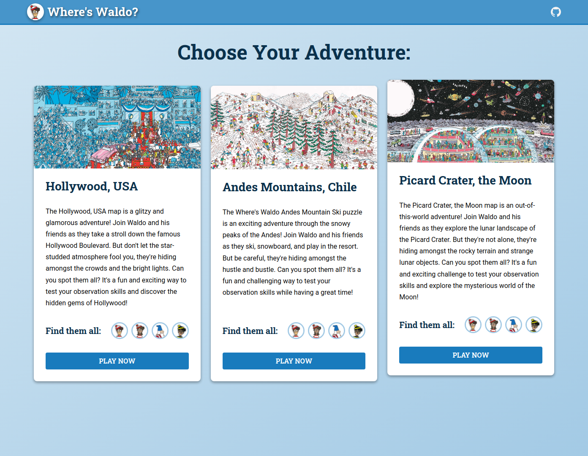

# Odin Project #22: Where's Waldo

Welcome to Bryan Miller's Where's Waldo Project, the [twenty secondth assignment](https://www.theodinproject.com/lessons/node-path-javascript-where-s-waldo-a-photo-tagging-app) within the Odin Project curriculum. The goal of this repo is to practice the following skill sets:

- TypeScript
- Redux Tool Kit
- React
  - Custom Hooks
  - High Order Components
- React Router DOM
- Firebase (BaaS)
  - Cloud functions
  - Firestore Database
- SASS
  - BEM naming convention

## Links

- [Live Demo](https://bmilcs.com/odin-wheres-waldo)
- [My Odin Project Progress](https://github.com/bmilcs/odin-project)

## Summary

Wow. This was a fun project. As simple as this game may seem, it included a LOT of new and unfamiliar technologies that I had to learn on the fly.

I'll begin by breaking down the folder structure:

### Folder Structure

Instead of segmenting files by their filetype (`.scss` to `styles/`), I decided to group components & their corresponding stylesheets, sub-components & functionality together:

```js
functions/      // backend (baas via Firebase)
  src/index.tsx // cloud functions
                // 1. validating character selections (found or not)
                // 2. saving to leaderboard (with leo-profanity filtering)

src/        // front-end logic
  index.tsx // react router dom & provider for redux toolkit store
  app/      // global scss, sets the core html & page routes: <header>, <main>
  assets/   // level/character images
  components/  // global components used across the app: Header, Buttons, CharacterIcons etc.
  data/     // central location for level & character data & images
  features/ // redux tool kit: global state management for core gameplay / levels
  firebase/ // direct interaction with firebase (backend as a service): initialization, cloud/async functionality
  hooks/    // custom hooks: useToggle
  pages/    // ties app together: home/ & level/ pages, with their own local components/ folder
    home/   // imports level data & creates the cards
    level/  // gameplay functionality
            // ** level-header:   timer/characters found & give up button
            // ** gameplay:       drop down menu, magnifying glass & game logic
            // ** gameover-modal: leaderboard display & form for saving progress
  utils/    // global functions
```

### Levels

When a user selects a level to play from `home/`, `pages/level/Level.tsx` receives the level data passed in through props. Then, it:

- Retrieves timer, remaining character counts & game status state variables from `src/features/levelSlice`.
- Dispatches reducer functions, setting `levelID` & `characters` state variables, resets the level & sets `timerEnabled` to true
- `useEffect()` #1: watches for changes to `timerEnabled` & begins the interval
- `useEffect()` #2: determines when a level has ended & dispatches reducer functions
- Renders level's sub-components: `LevelHeader`, `GamePlay` & `GameOverModal`

> `levelSlice` (Redux ToolKit)

```ts
const initialState: LevelState = {
  id: "",
  characters: {
    remaining: {
      names: [],
      count: 0,
    },
    found: {
      names: [],
      coordinates: [],
      count: 0,
    },
  },
  timer: {
    value: 0,
    formatted: "",
    enabled: false,
  },
  headerHeightInPixels: 0,
  status: "active",
  clickedCoordinates: [0, 0],
};
```

### GamePlay

`src/pages/level/GamePlay` does what it should: controls gameplay. To summarize, it's responsibilities include:

Handling user interaction:

- Mouseover: displays magnifier
- Click:
  - If menu is closed, displays drop down menu with remaining characters to be found
  - If menu is open, it calls a firebase cloud function `validateCharacterPosition` to determine if the user found & selected the right character name

In order to validate the positions correctly, I had to convert all coordinates to percentages. Pixels would have only worked on a static screen size.

Creating the magnifier presented a challenge but fortunately, [Axiny from dev.to](https://dev.to/anxiny/create-an-image-magnifier-with-react-3fd7) had solved the problem for me. However, adding the sticky header threw off all of the calculations, which I discuss below in "Problems Overcome".

Validating the user's selections (character name and coordinates) is achieved through Firebase Cloud Functions (`/functions/src/index.ts`). The `validateCharacterPosition` function receives the user's selection, pulls the character's coordinates from the database, and then calls a locally scoped function `isWithinCoordinateRange` to determine the results.

From there, the response is parsed by the frontend's `isCharacterFound` function, dispatching reducers which trigger updates the UI.

> Note: Some variables are pulled from the parent React Functional Component

```tsx
const isCharacterFound = (characterName: string) => {
  // firebase cloud function
  validateCharacterPosition({
    characterName: characterName,
    coordinates: coordinates,
    levelID: id,
  })
    .then((res) => {
      const data = res.data as ValidateCharacterPositionResults;
      const isFound = data.isFound as boolean;
      const character = data.characterName as string;
      if (!character) return;
      if (isFound) {
        dispatch(moveCharacterToFoundArray(character));
        dispatch(updateCharacterCounts());
      }
    })
    .catch((e) => console.log(e));
};
```

> Database Screenshot


### GameOverModal & Leaderboard

The leaderboard was trickier than expected. Firebase Cloud Functions were a new concept for me and their syntax has changed over the years, making StackOverflow responses different from the current best practices.

I opted to use `onCall` functions, which let you call cloud functions directly without the use of API & `fetch`. In hindsight, I should've opted for the more universally used HTTP API endpoint.

The asynchronous flow for displaying the leaderboard is as follows:

- `useEffect()` displays the current state of the leaderboard on first render
- On submission of the user's name, the form is hidden & `saveToLeaderboard` cloud functions called
- On the backend, this cloud function filters out profanity, adds it to the database & returns an object: `{ added: boolean} `
- On the frontend, the result is parsed. If `added` is `true`, the `getLeaderboardTopTen()` function is called, updating the local state variable `leaderboard`, causing a re-render that displays the user's score

### Problems Overcome

This project was my first look at TypeScript, Redux Tool Kit, Firebase Cloud Functions, custom hooks & the BEM naming convention. There were countless lessons learned along the way, but here are a few of the most notable.

#### Redux Tool Kit: Asynchronous state updates

As I stumbled my way through learning the Redux Tool Kit, my attempts to call the `validateCharacterPosition` Firebase Cloud Function within the levelSlice reducer kept throwing an error. It wouldn't allow me to update state within a `.then()`. My goal was to update `state.characters.remaining` & `state.characters.found` objects based on the result of the function call.

To get around this, I moved the async function call to the GamePlay React Component & handled the conditional logic there. If a character's found, it dispatches the `moveCharacterToFoundArray` reducer.

#### Sticky Level Header: Broke the Magnifier

By adding a sticky header for each level, the calculations for displaying the magnifier broke. To get around this, I setup a state variable in the `levelSlice` called `headerHeightInPixels`. When the `LevelHeader` is rendered, I dispatch a reducer to set this value and inside `GamePlay`, I had to adjust the calculations to reposition the zoomed image.

#### Glitchy Magnifier: Scrollbar Toggling Spam

When hovering the mouse to the far right side of the screen, the overflowing magnifier element would cause the scrollbar to flash on and off repeatedly. This resulted in an unpolished UI/UX.

To get around this, I modified the calculations for displaying the magnifier based on the location of the mouse, magnifier width & image width in pixels (vs. percentages used to validate character position).

```tsx
const updateMagnifierPosition = (e: React.MouseEvent): void => {
  const elem = e.currentTarget;
  const { top, left } = elem.getBoundingClientRect();

  // calculate cursor position on the image
  const magX = e.pageX - left - window.pageXOffset;
  const magY = e.pageY - top - window.pageYOffset + headerHeight;

  // prevent magnifier from extending beyond image boundaries
  // on the right side only because it causes scrollbar to rapidly
  // appear and disappear
  if (imgWidth - magX < magnifierWidth / 2) return;

  setMagnifierXY([magX, magY]);
};
```

#### Firebase Emulation

While developing this project, deploying changes to the firebase functions on every change became tiresome. In order to emulate the backend, I had to export the database containing the character's locations locally using `gsutils` from Google. The db was stored in `/functions/db`.

Firestore cloud function emulation was achieved with a simple one-liner: `connectFunctionsEmulator(functions, "localhost", 5001);`

#### Time Limitations

Despite my desire to keep going with this project, I cut it short despite wanting to fine tune every last detail. Some features I would've liked to have implement include:

- Drawing circles around previously found characters
- Larger gameplay images with automatic scrolling when the user hovers near the edge of the page
- Leaderboard pages or leaderboard displays on the homepage
- More levels
- Better overall design & responsiveness

## Screenshots

> Figma Assets


> Home



> Gameplay


> Solutions for testing purposes


## Deployment

```sh
# clone repo & change directories
git clone https://github.com/bmilcs/odin-wheres-waldo
cd odin-wheres-waldo

# install all dependencies
npm install

# run app
npm start
```
